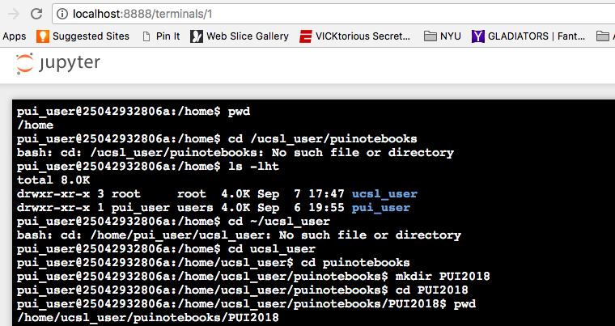
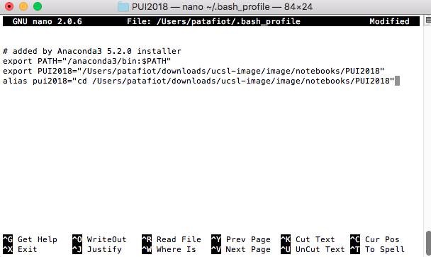
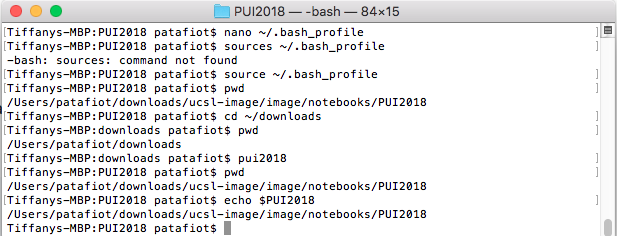

#HW1 for PUI 2018

Tiffany Patafio

In homework two, we aimed to create environmental variables and aliases to allow for reproducible research across machines and environments. In particular, the goal was to create a single environmental variable ($PUIDATA) to refer to a new directory and alias (pui2018) to navigate to said directory.

To begin, I created a local directory "PUI2018" using the mkdir command: 

Next, I modified the bashrc file to include both the environmental variable and the alias: 

Lastly, I tested to ensure that my modifications worked as expected: 
