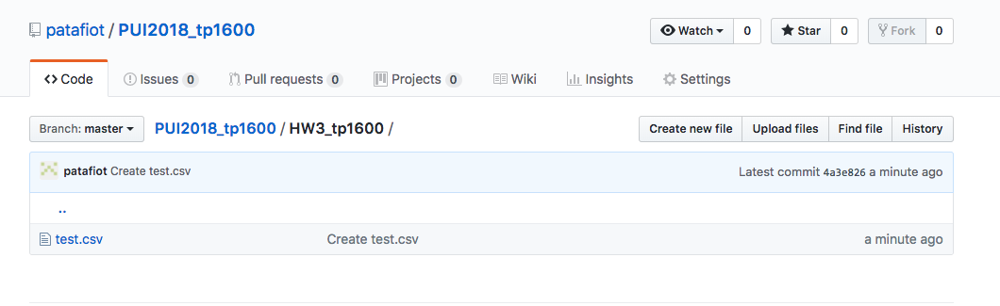
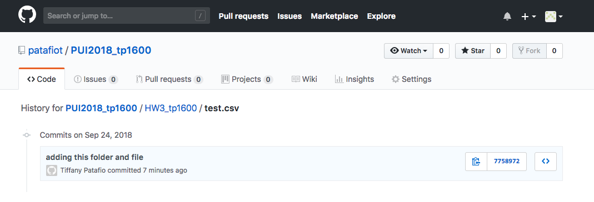
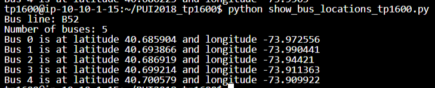

# Homework 3
### Tiffany Patafio
### September 2018

For Homework Assignment 3, we had 4 major tasks to complete:
  1. Permanently delete a file on github
  2. Create a plot from NYC Open Data
  3. Write a script to stream real time data from MTA API which returns in the Terminal
  4. Write a script to stream real time data from MTA API which returns in a .csv
 
For assignment 1, we needed to prove that a file was added: 

And subsequently deleted from our github repo:

(Note no activity is logged for the date the file existed.)

For assignment 2, I used Citywide Payroll data to plot Salary vs Overtime hours, 
noting that Overtime hours were highest amongs lower salary workers as shown in Figure 1 below:

For assignments 3 & 4, I created .py files which can be run directly within the terminal to 
retrieve and return data from the MTA API. The biggest hurdle is the format of the data as a JSON file, 
which requires significant navigation in Python due to the nested nature of the data. Outputs were shown 
both directly in terminal: 

As well as in a .csv output file, such as the homeworktest.csv output in my HW3_tp1600 directory.

Contributions & Credits: While I primarily worked alone (particularly for homeworks 1,2, and 4), 
I collaborated with Alia Kasem, specifically on getting the output of homework 3 to work properly 
through loops and adding correctly formatted headers.
